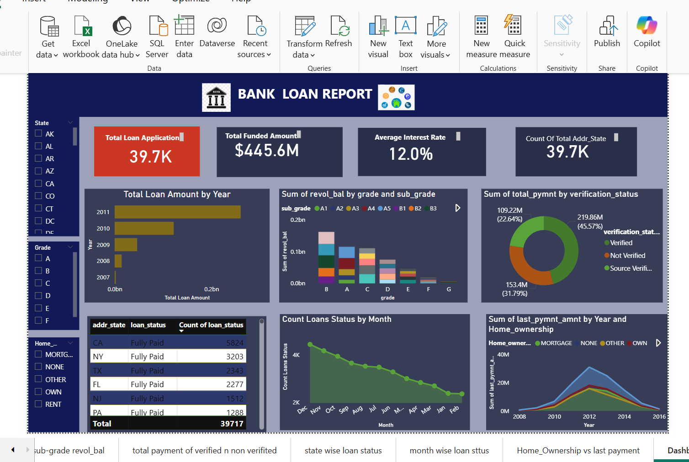
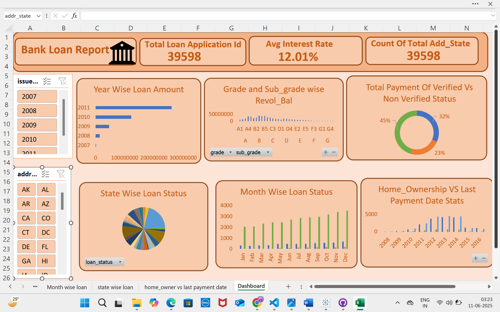

# 💳 Customer Bank Loan Analysis

## 🖼️ Dashboard Preview

### 🖼️ Power BI Dashboard

### 🖼️ Excel Dashboard

## 📊 Project Overview
This project visualizes and analyzes customer bank loan data using Power BI, Excel and SQL. It provides meaningful insights into loan application volumes, repayment behavior, borrower credit grades, and geographic distribution. The report is aimed at helping financial institutions understand customer profiles, identify risk zones, and enhance lending strategies.

---

## 🎯 Objective
- Analyze total loan applications and funded amounts
- Explore borrower credit grades and their revolving balances
- Evaluate repayment trends based on customer verification status
- Identify loan trends by geography, month, and home ownership

---

## 🧰 Tools Used

| Tool        | Purpose                      |
|-------------|-------------------------------|
| **Power BI**| Data visualization & dashboard |
| **Excel**| Data visualization & dashboard |
| **MYSQL**| Data Cleaning |
||

---

## 📈 Key Metrics

| Metric                        | Value     |
|------------------------------|-----------|
| Total Loan Applications       | 39.7K     |
| Total Funded Amount           | $445.6M   |
| Average Interest Rate         | 12.0%     |
| Unique Customer Locations     | 39.7K     |

---

## 🔍 Dashboard Insights

### 📅 Loan Amount by Year
- Highest disbursements in 2010–2011.
- Year-on-year growth in loan activity observed.

### 🗺️ State-wise Loan Status
- Top states with fully paid loans: **CA, NY, TX, FL**.
- Indicates strong loan performance in these regions.

### 📊 Grade vs. Revolving Balance
- Grade **B** and **C** customers have highest revolving balances.
- Lower-grade borrowers have smaller loan exposures.

### ✅ Repayment by Verification Status
- Verified: $219.86M (45.57%)
- Not Verified: $109.22M (22.64%)
- Source Verified: $153.4M (31.79%)
- Conclusion: **Verification improves repayment performance.**

### 📆 Monthly Loan Count
- Peak in **December**, steady decline into **February**.
- Seasonal patterns visible in loan applications.

### 🏠 Home Ownership vs Last Payment
- Mortgage holders contribute more consistent, higher payments.
- Indicates stable repayment trends among homeowners.
